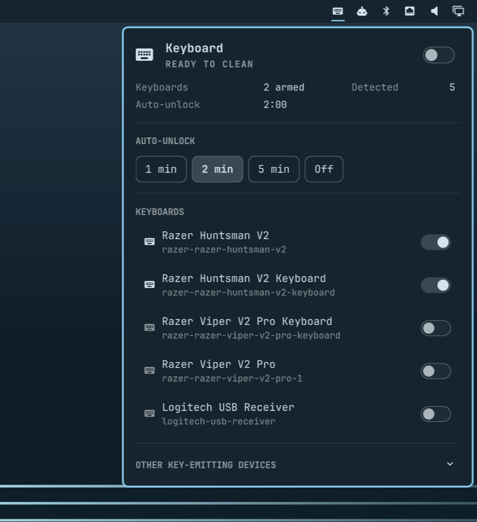

<h1 align="center">Keyboard Cleaner</h1>

<p align="center">Disable your keyboard so you can wipe it down, and unlock it with the mouse.</p>

<p align="center">
  
</p>

An Omarchy bar widget. Click the keyboard icon, pick which input devices to
freeze, and hold the mouse on the unlock button when you're done.

The block is Hyprland's per-device `enabled` flag, so a locked keyboard delivers
nothing at all — no keys, no modifiers, no keybinds, no IME. Only keyboards are
ever disabled, so the mouse is always there to get you out.

## Install

```bash
omarchy plugin add https://github.com/roymelgarv/omarchy-keyboard-cleaner.git --enable
```

Then place the widget:

```bash
omarchy bar move roymelgarv.omarchy-keyboard-cleaner --section right
```

## Usage

Click the keyboard icon in the bar to open the panel, arm the devices you want
frozen, and flip the switch. An overlay takes over the screen; hold the unlock
button with the mouse to end the session, or wait for auto-unlock. Clicking the
bar icon while locked also unlocks immediately.

Real keyboards are armed for you on first run. Everything else Hyprland reports
as a keyboard — power buttons, headset controls, laptop hotkey stubs — sits
behind the **other key-emitting devices** reveal, because udev says they carry
no typeable key range.

From the shell:

```bash
omarchy-shell keyboard-cleaner toggle    # open/close the panel
omarchy-shell keyboard-cleaner lock      # start a cleaning session
omarchy-shell keyboard-cleaner unlock    # end it
omarchy-shell keyboard-cleaner status    # JSON: locked, arming, devices, remaining
```

Omarchy plugins cannot ship keybindings — the installer never runs plugin code
or writes Hyprland config. Add one yourself in `~/.config/hypr/bindings.lua`:

```lua
o.bind("SUPER + SHIFT + K", "Clean keyboard", "omarchy-shell keyboard-cleaner lock")
```

Locking waits for every physical key to come up before disabling anything — a
key held at the moment its device goes dead never delivers its release, and
would read as stuck afterwards. The overlay shows **Release all keys** during
that window. From the bar button it's imperceptible; from a keybinding it lasts
as long as you keep holding SUPER+SHIFT.

## Requirements

Everything here ships with a standard Omarchy install; the plugin adds no
dependencies of its own.

| Needs | Used for |
| --- | --- |
| Hyprland (`hyprctl`) | Toggling each device's `enabled` flag, and reading held-key state via `hl.is_key_down` |
| `jq` | Parsing `hyprctl -j` output and writing the runtime state file |
| `udevadm` (systemd) | Telling real keyboards apart from other key-emitting devices |
| `bash`, `awk` | The two bundled scripts in `bin/` |
| `omarchy-shell idle` | Parking the idle timer for the duration of a session |

The plugin runs unsandboxed inside the Omarchy shell process with your user's
permissions, as every Omarchy plugin does. What it does with them is narrow: it
shells out to `hyprctl` to flip the `enabled` flag on the devices you armed and
to `udevadm`/`hyprctl -j` to enumerate them, and it writes exactly two files —
your settings at `~/.config/omarchy/keyboard-cleaner.json`, and session state
under `$XDG_RUNTIME_DIR/keyboard-cleaner/` (tmpfs, cleared on reboot). **No
root, no daemon, no evdev grab, no network access**, and no setuid helper. The
block is entirely compositor-side.

## Safety

The only way out of a locked session is the mouse, so:

- **Only keyboards are ever disabled.** Pointing devices are left alone by
  construction, so the unlock button is always reachable.
- **Auto-unlock** is on by default (2 minutes, configurable, can be turned off).
- **Idle is parked** for the duration via `omarchy-shell idle disable`. A
  disabled keyboard stops feeding the idle timer, so without this a long wipe
  would trip the idle lock and drop you at a password prompt you cannot type
  into.
- **Session state lives in `$XDG_RUNTIME_DIR`**, never in
  `~/.local/state/omarchy/toggles/hypr/`. Hyprland sources that directory on
  every config reload; persisting a keyboard disable there would survive reboot
  and lock you out permanently.

### If you get stuck

In escalating order:

1. Hold the unlock button on the overlay.
2. Wait for auto-unlock.
3. Click the bar icon — it unlocks immediately while a session is active.
4. From another machine over SSH:
   `~/.config/omarchy/plugins/roymelgarv.omarchy-keyboard-cleaner/bin/keyboard-cleaner-lock unlock`
5. **Reload Hyprland's config.** `omarchy-restart-hyprctl`, a theme switch, or
   touching `~/.config/hypr/hyprland.lua` all clear `m_deviceConfigs`, and every
   device defaults back to enabled.
6. **A TTY.** The block is compositor-side, so `Ctrl+Alt+F2` is unaffected.

Because of (5), a theme switch mid-wipe will silently unlock you. That is a
deliberate trade: the panic button is worth more than surviving a reload.

## Remove

```bash
omarchy plugin remove roymelgarv.omarchy-keyboard-cleaner
```

Disabling or removing the plugin during a cleaning session ends that session
first — the service re-enables your keyboards and restores idle handling on its
way out. That matters because removal deletes the plugin folder, and with it the
`bin/keyboard-cleaner-lock` script this README points you at for recovery.

Your settings at `~/.config/omarchy/keyboard-cleaner.json` are deliberately left
behind, so reinstalling restores your armed devices and auto-unlock preference.
Delete that file too for a clean slate. Session state lives in
`$XDG_RUNTIME_DIR/keyboard-cleaner/` and disappears on reboot regardless.

## Known gaps

- Hotplugging a keyboard mid-session leaves it enabled; it was not in the
  armed set.
- Pointer locking (touchpad while wiping a laptop keyboard) is not implemented.
  `bin/keyboard-cleaner-devices` already reports pointers; the UI ignores them.

## Contributing

See [CONTRIBUTING.md](CONTRIBUTING.md) — PRs target `development`, not `main`.
It also covers how the device classification and held-key handling work, and how
to run the plugin from a working copy.

## License

[MIT](LICENSE)
